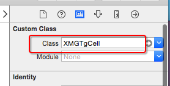

## 新建一个继承自`UITableViewCell`的子类，比如XMGTgCell
```objc
@interface XMGTgCell : UITableViewCell
@end
```

## 在storyboard文件中，找到UITableView里面的cell（动态cell）
- 修改cell的class为XMGTgCell



- 绑定循环利用标识


- 添加子控件，设置子控件约束


- 将子控件连线到类扩展中

```objc
@interface XMGTgCell()
@property (weak, nonatomic) IBOutlet UIImageView *iconImageView;
@property (weak, nonatomic) IBOutlet UILabel *titleLabel;
@property (weak, nonatomic) IBOutlet UILabel *priceLabel;
@property (weak, nonatomic) IBOutlet UILabel *buyCountLabel;
@end
```

## 在XMGTgCell.h文件中提供一个模型属性，比如XMGTg模型
```objc
@class XMGTg;

@interface XMGTgCell : UITableViewCell
/** 团购模型数据 */
@property (nonatomic, strong) XMGTg *tg;
@end
```

## 在XMGTgCell.m中重写模型属性的set方法
- 在set方法中给子控件设置模型数据

```objc
- (void)setTg:(XMGTg *)tg
{
    _tg = tg;

    // .......
}
```

## 在控制器中
- 给cell传递模型数据

```objc
- (UITableViewCell *)tableView:(UITableView *)tableView cellForRowAtIndexPath:(NSIndexPath *)indexPath
{
    static NSString *ID = @"tg";
    // 访问缓存池
    XMGTgCell *cell = [tableView dequeueReusableCellWithIdentifier:ID];

    // 设置数据(传递模型数据)
    cell.tg = self.tgs[indexPath.row];

    return cell;
}
```

